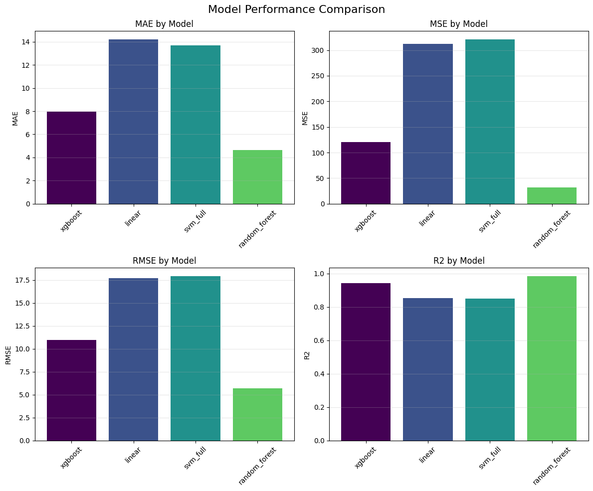

# Training Module

ML model training pipeline for ticket time prediction using multiple regression algorithms.

## Overview

This module trains and evaluates various machine learning models to predict ticket resolution times. It currently supports:

- **Random Forest** - Ensemble method for robust predictions
- **Linear Regression** - Fast, interpretable baseline
- **SVM (with kernel approximation)** - Non-linear modeling with scalability
- **XGBoost** - Gradient boosting for high performance

## Quick Start

### Run Training

```bash
# Validates the training pipeline
just pytest

# Train specific models (from repo root)
just train -m forest linear

# Train with custom run ID
just train -r my_run_123
```

### Output

Training outputs are saved to `models/{run_id}/`:

- `{model_name}.pkl` - Trained model file
- `eval_{model_name}.json` - Performance metrics (MAE, MSE, RMSE, R²)
- `best.txt` - contains name of the best performing model

### Performance Visualization

Example metrics from recent training run:



## Project Structure

```
training/
├── training/
│   ├── cmd/
│   │   └── train.py              # Main training entry point
│   └── trainers/
│       ├── train_forest.py        # Random Forest trainer
│       ├── train_linear.py        # Linear regression trainer
│       ├── train_svm.py           # SVM trainer
│       ├── train_xgboost.py       # XGBoost trainer
│       └── utils/
│           └── harness.py         # Shared utilities & Dataset class
├── tests/
│   ├── test_cmd_train.py         # Command logic tests
│   └── test_trainers.py          # Model trainer tests
└── README.md
```

## Adding New Models

To add a new model:

1. **Create trainer module** - `apps/training/training/trainers/train_mymodel.py`
   ```python
   from training.trainers.utils.harness import X_t, Y_t, load_fit_dump
   from sklearn.model_selection import PredefinedSplit, RandomizedSearchCV

   def fit_grid(x: X_t, y: Y_t, cv_split: PredefinedSplit) -> RandomizedSearchCV:
       """Implement hyperparameter grid search."""
       # Your implementation
       return grid.fit(x, y)

   def main(run_id: str) -> None:
       load_fit_dump(fit_grid, run_id, "mymodel")

   if __name__ == "__main__":
       main("TESTING")
   ```

2. **Register model** - Update `models` set in `training/cmd/train.py`:
   ```python
   models = {"forest", "linear", "svm", "xgboost", "mymodel"}
   ```

3. **Add tests** - Extend `tests/test_trainers.py` with trainer tests using `@pytest.mark.filterwarnings("ignore")` decorator

4. **Test with subset data**:
   ```python
   from training.trainers.utils.harness import Dataset
   x, y, cv_split = Dataset.as_sklearn_cv_split(subset_size=20)
   ```

## Testing

```bash
# Run all training tests with warning suppression
just pytest apps/training/tests/

# Run with verbose output
just pytest apps/training/tests/ -v
```

Dataset Loading Options

The `Dataset` class supports loading full or subset data for testing:

```python
from training.trainers.utils.harness import Dataset

# Full dataset (100 samples)
dataset = Dataset(split="train")

# Subset for fast testing (20 samples)
dataset = Dataset(split="train", subset_size=20)

# Get train/val split with combined data
x_combined, y_combined, cv_split = Dataset.as_sklearn_cv_split(subset_size=20)
```

## Dependencies

- scikit-learn - ML algorithms and utilities
- XGBoost - Gradient boosting
- Polars - Fast dataframe operations
- numpy - Numerical computing

See `pyproject.toml` for exact versions.
